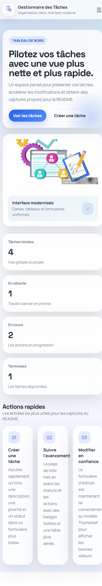

# Gestionnaire des tâches

Application Spring Boot de gestion de tâches avec interface Thymeleaf, authentification simple et base H2 en mémoire.

## Fonctionnalités

- Tableau de bord d’accueil avec indicateurs.
- Liste des tâches avec badges de statut et actions.
- Formulaire d’ajout et de modification modernisé.
- Pages de connexion et d’inscription au design cohérent.

## Lancer le projet

```bash
./mvnw spring-boot:run
```

Sous Windows :

```powershell
.\mvnw.cmd spring-boot:run
```

Ouvrir ensuite :

- http://localhost:8080/accueil
- http://localhost:8080/taches
- http://localhost:8080/ajouter
- http://localhost:8080/login

## Captures recommandées

1. Accueil avec les compteurs visibles.
2. Liste des tâches avec au moins quelques éléments.
3. Formulaire d’ajout.
4. Formulaire de connexion.

## Captures d’écran




## Notes

- Les tâches de démonstration sont générées au démarrage si la base est vide.
- La date limite est calculée automatiquement selon la priorité choisie.
